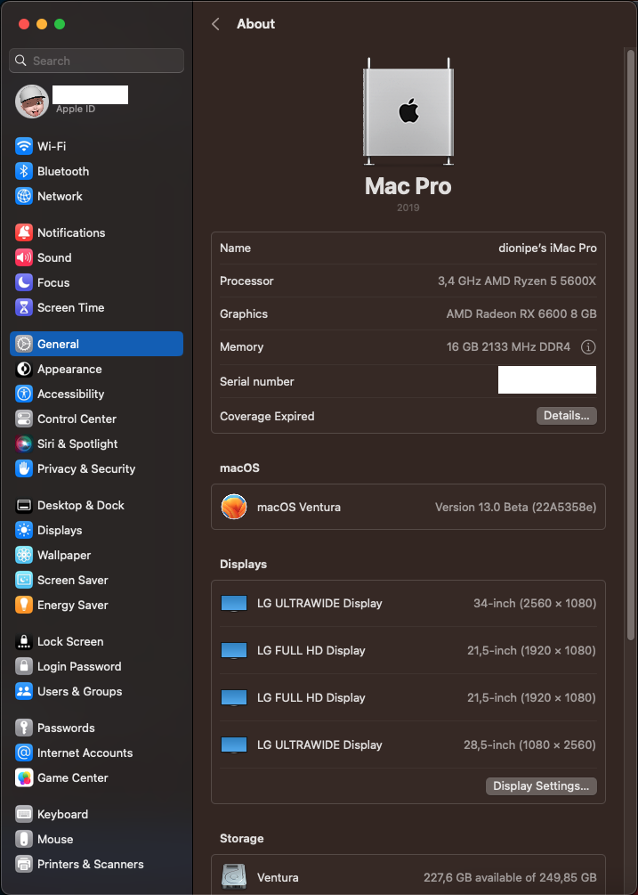

# Ventura13.0-RX6600-R5-2600-2022
 MacOS Ventura 13.0 For AMD Ryzen 5 2600 and GPU RX6600

    \
\

## Important information
* This EFI supports only MacOS versions catalina(10.15) and higher. Your system will not boot if you use this on Mojave and High Sierra.
* Ventura incremental OTA updates may fail post beta1 and force you to download the full installer. This is probably due to BluetoolFixup and IntelBluetoothFirmware kext's. If you use these kext's in your setup like i do, you can overcome this issue by disabling the kext's in your config.plist prior to running your updates and enable them back post updation.

## Specification

| Component        | Model                                              |
| ---------------- | ---------------------------------------------------|
| CPU              | AMD Ryzen 5 2600                                   |
| MotherBoard      | AsRock B450M Steel Legend Elite                          |
| OS Disk          | Samsung SSD 870 EVO 250GB       256gb              |
| RAM              | 2x 8gb Corsair Vengeance Pro 32GB Ram              |
| GPU              | AMD Radeon RX6600 4gb                               |

## Patches, Drivers & Kexts

* [AppleALC](https://github.com/acidanthera/AppleALC)
* [AppleMCEReporterDisabler](https://github.com/acidanthera/bugtracker/files/3703498/AppleMCEReporterDisabler.kext.zip)
* [BrcmPatchRAM](https://github.com/acidanthera/BrcmPatchRAM)
* [Kernel Patches](https://github.com/AMD-OSX/AMD_Vanilla) ( Newer universal patches introduced in [this](https://github.com/sileshn/Ryzentosh/commit/adcb87fa003a0e77afaded014984a00ecb07b775) commit requires you to update the core count of your processor. For more information on this subject, click [here](https://github.com/AMD-OSX/AMD_Vanilla#read-me-first).)
* [Lilu](https://github.com/acidanthera/Lilu)
* [OpenCore](https://github.com/acidanthera/OpenCorePkg)
* [OpenIntelWireless](https://github.com/OpenIntelWireless)
* [RealtekRTL8111](https://github.com/Mieze/RTL8111_driver_for_OS_X)
* [RestrictEvents](https://github.com/acidanthera/RestrictEvents)
* [VirtualSMC](https://github.com/acidanthera/VirtualSMC)
* [WhateverGreen](https://github.com/acidanthera/WhateverGreen)

## Credits and links

* [OpenCore install guide](https://dortania.github.io/OpenCore-Install-Guide)
* [Hackintool](https://www.hackintosh-forum.de/forum/thread/38316-hackintool-ehemals-intel-fb-patcher)
* [OpenCore-Legacy-Patcher](https://github.com/dortania/OpenCore-Legacy-Patcher)
* [OpenCore-Legacy-Patcher guide](https://dortania.github.io/OpenCore-Legacy-Patcher)